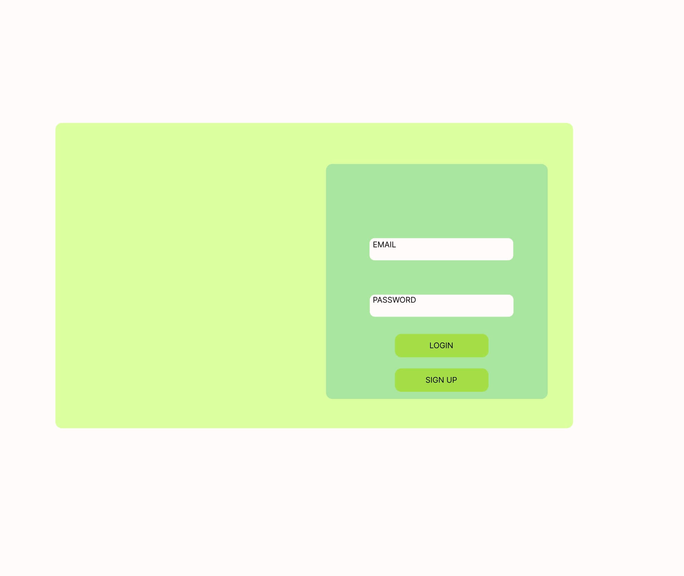
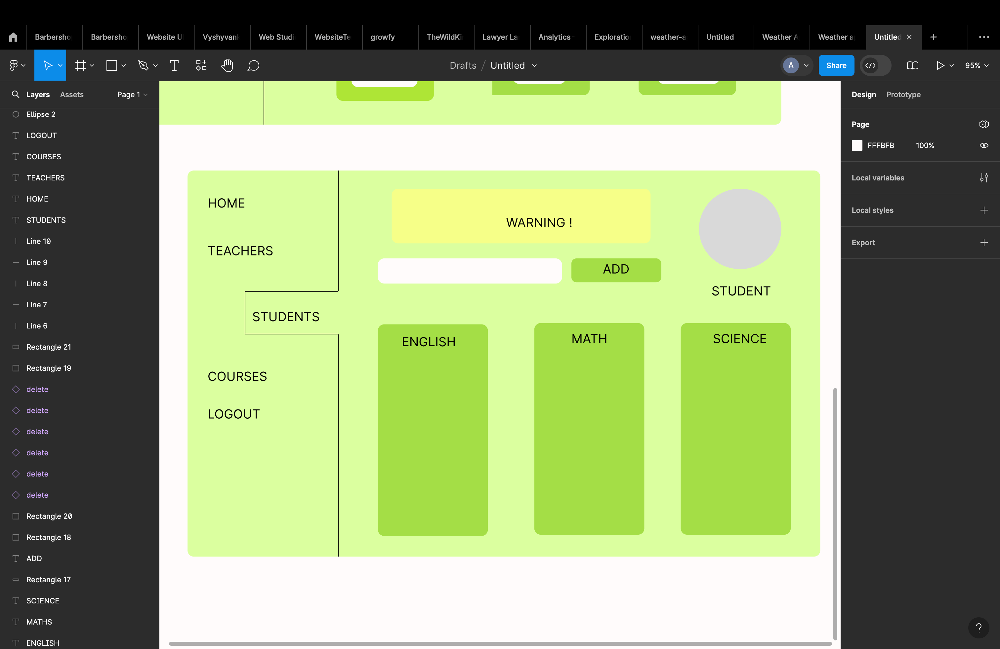
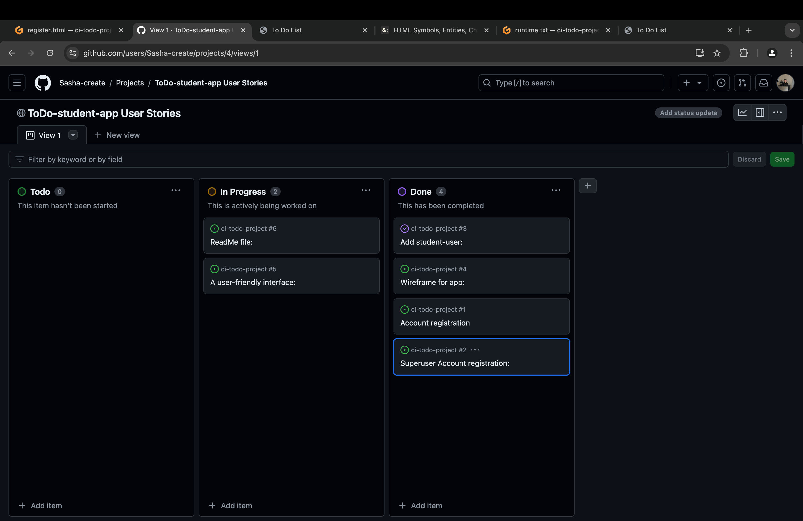
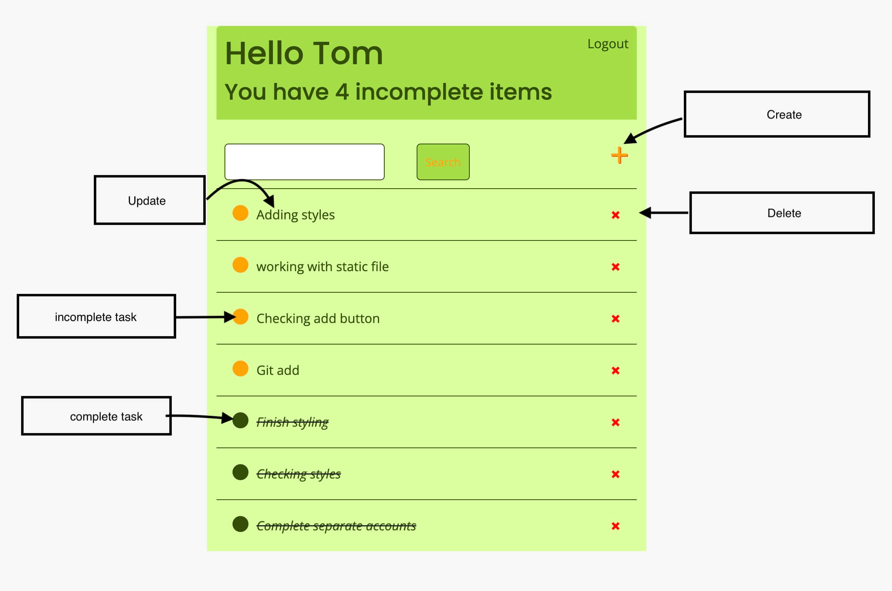
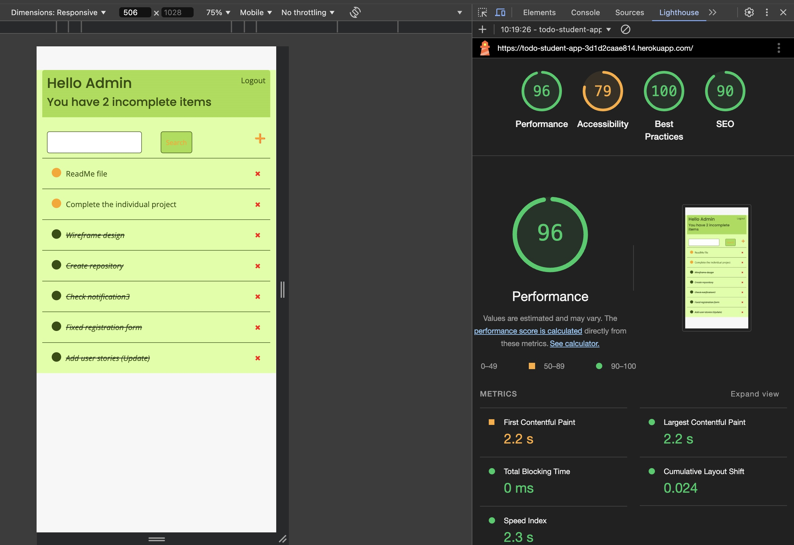

# TODO-students-app

This is a Django-based web application for managing a student's to-do list. The application supports basic CRUD operations, allowing students to create, view, update and delete tasks.
 

## **[Link to Live Site](https://todo-student-app-3d1d2caae814.herokuapp.com/login/)**  

*This project is created as a final portfolio project for the Code Institude.*  

## Table of Contents  

 1. [ UX/UI Design ](#ux/ui-design)
 2. [ Agile Development ](#agile-development)
 3. [ Features implemented ](#features-implemented)  
 4. [ Technology used ](#technology-used) 
 5. [ Testing ](#testing-and-Validation)  
 6. [ Bugs ](#known-bugs)  
 7. [ Deployment](#deployment)
 8. [ Resources ](#resources)  
 9. [ Credits and acknowledgements ](#credits-and-acknowledgements)

 ## UX/UI Design

 The design of the TODO-students-app was crafted using Figma, focusing on a user-friendly interface and seamless user experience. The clean and intuitive design helps users quickly find the information they need.

 ## Agile Development

**[Link to Kanban board](https://github.com/users/Sasha-create/projects/4)**  

 

 ## Features implemented

- **Login Page:**
  - Secure signup functionality allows users to register securely.
  - Successful login redirects users to the task/home page.
- **Registration Page:**
  - Secure login functionality allows users to log in securely.
  - Successful registration redirects users to the task/home page.
- **Logout Page:**
  - Logout functionality allows users to sign out securely.
  - After successful logout, users are redirected to the task/home page.
 - **Add Tasks:** Students can create new tasks, specifying the task's name, description.
- **View Tasks:** Tasks are displayed in a list format, showing essential details like the task's name and status.
- **Update Tasks:** Students can update existing tasks, modifying any of the details.
- **Delete Tasks:** Students can remove tasks that are no longer needed.
- **Task Status:** Tasks can be marked as complete or incomplete.
- **Responsive Design:** The app is designed to work well on desktop/tablet/mobile devices.

 ## Technology used

- **Django framework:**
- Django: This is the main framework used to build the application. Django is a high-level Python web framework that encourages rapid development and clean, pragmatic design.
- Views: Django views handle the logic of your app. You can use both function-based views (FBVs) and class-based views (CBVs).
- Models: Define the database schema for your app. For example, you might have a Task model with fields like title, description, due_date, and completed.
- Forms: Django forms are used to handle user input, such as creating or updating a task.
- URLs: Manage the routing for the application. Django's URL dispatcher maps URLs to views.
- **Database:**
- PostgreSQL: This is the database system used to store all the app data, such as users, tasks, etc.
- Django ORM (Object-Relational Mapping): Interacts with PostgreSQL. Define models in Python, and Django handles the SQL behind the scenes.
- **HTML:**
- For structuring the web pages.
- **CSS:**
- For styling and layout.
- **Javascript:**
- For dynamic content and interactions.

 ## Testing

 #### Account Registration Tests

| Test |Result  |
|--|--|
| User can create profile | Pass |
| User can log into profile | Pass |
| User can log out of profile | Pass |
| Messages are displaying | Pass |

#### CRUD Tests

| Test |Result  |
|--|--|
|User can create a task | Pass |
|User can update a task | Pass |
|User can delete a task | Pass |
|User can read a task | Pass |

#### Google Chrome testing with Lighthouse

 ## Bugs

 The issues specifically with CSS, HTML, and notifications during login/logout. 

 ## Deployment

- Gunicorn: A Python WSGI HTTP Server for UNIX. It’s used to serve your Django application.

- Heroku: cloud platforms for deployment.

**[Link to Live Page](https://todo-student-app-3d1d2caae814.herokuapp.com/login/)**

 ## Resources

- [Code Institute Full Stack Development course materials](https://codeinstitute.net/) 
- [Django docs](https://www.djangoproject.com/)
- [Bootstrap docs](https://getbootstrap.com/docs/5.0/getting-started/introduction/)
- [Stack overflow](https://stackoverflow.com/)
- [Dev Community](https://dev.to/)
- [Code Institude Slack](https://slack.com/)
- [W3school](https://www.w3schools.com/)
- [MDN](https://developer.mozilla.org/en-US/)
- [Figma](https://www.figma.com/)
- [TinyPNG](https://tinypng.com/)

 ## Credits and acknowledgements

- Bootcamps Lead **David Calikes** for his support and guidance during the process
- Course Facilitator **Alexander Tastad** for his help, support and guidance during the process 
- Tutor **Martin McInerney** for his endless patience and support with trouble shooting issues
- Tutor **Kevin Loughrey** for his helpful SME sessions and constant support
- My fellow **cohort peers** for their support, help with trouble shooting issues and sharing the experience